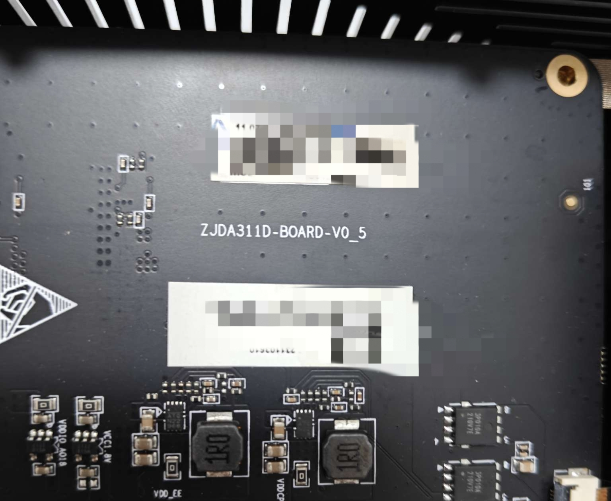
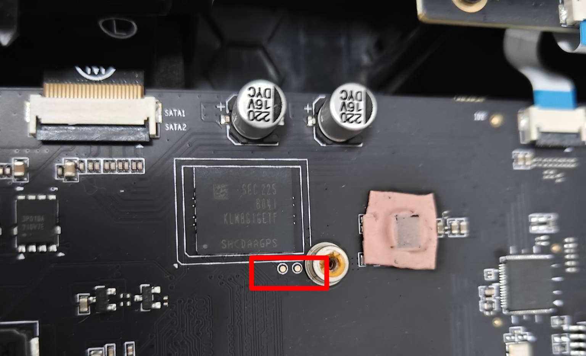
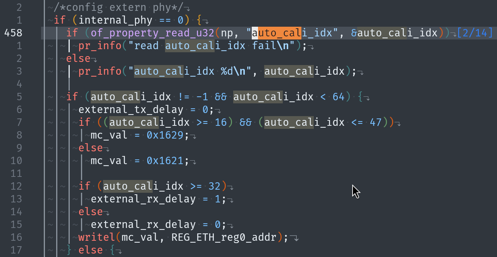
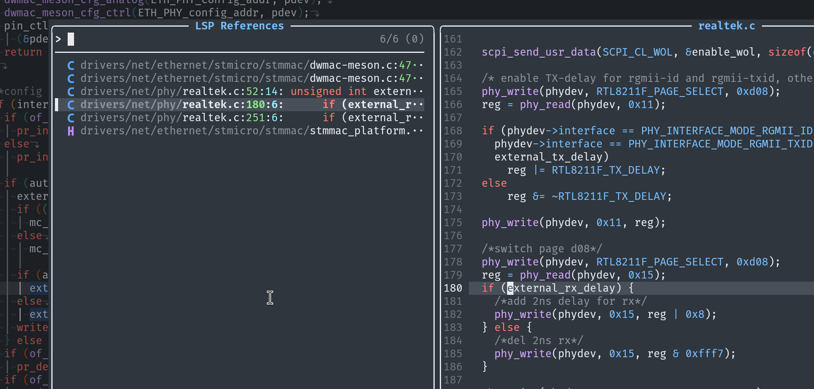
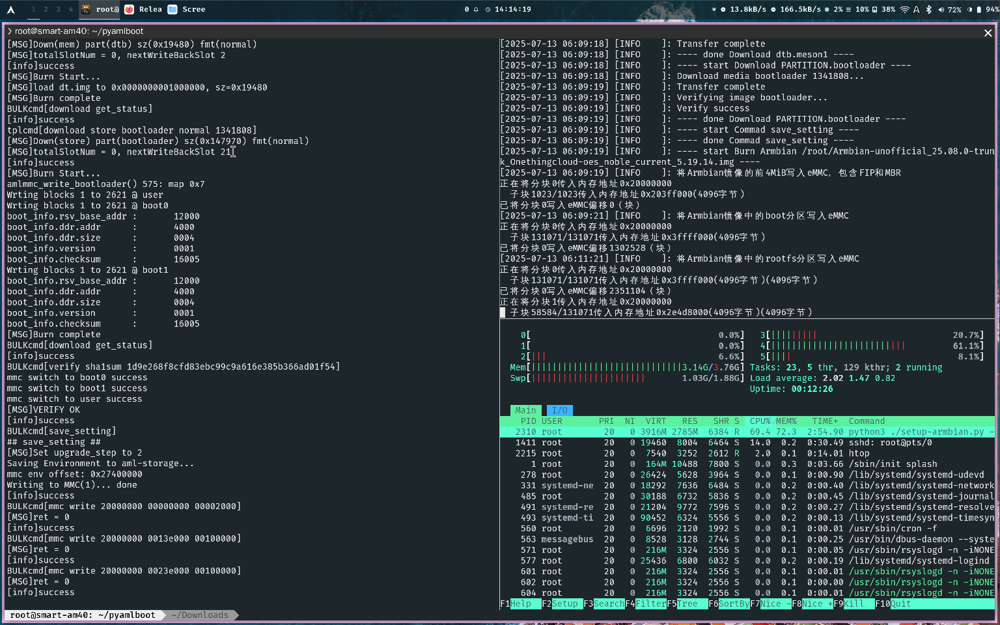
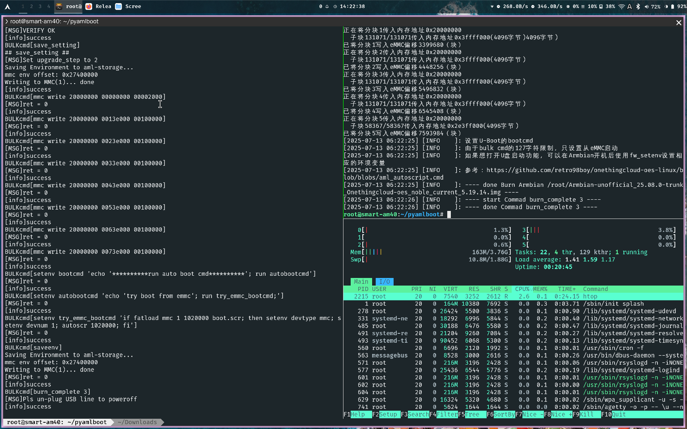

# 固件

[Armbian](https://github.com/retro98boy/armbian-build)

Armbian固件包含`meson-g12b-a311d-onethingcloud-oes.dtb`和`meson-g12b-a311d-onethingcloud-oes-rgmii-rx-delay-3000ps.dtb`，默认使用`meson-g12b-a311d-onethingcloud-oes.dtb`

在没有接出串口的情况下

如果通过U盘启动Armbian后发现网络不正常，可以拔下U盘在PC上修改boot分区中的armbianEnv.txt，指定fdtfile为`meson-g12b-a311d-onethingcloud-oes-rgmii-rx-delay-3000ps.dtb`并开机重测网络

如果已知设备必须使用`meson-g12b-a311d-onethingcloud-oes-rgmii-rx-delay-3000ps.dtb`网络才正常，又想参考下文直接将Armbian镜像刷入eMMC，可以提前修改img文件中的armbianEnv.txt。对于Linux用户可参考[此处](https://github.com/retro98boy/tiannuo-tn3399-v3-linux?tab=readme-ov-file#%E5%AF%B9%E7%9B%B8%E5%90%8Csoc%E7%9A%84%E7%B3%BB%E7%BB%9F%E9%95%9C%E5%83%8F%E8%BF%9B%E8%A1%8C%E7%A7%BB%E6%A4%8D)，对于Windows用户可使用DiskGenius软件

# 硬件



eMMC短接点：



调试串口：


# 安全启动

在设备上电log中存在：

```bash
[1.244567 Inits done]
secure task start!
high task start!
low task start!
run into bl31
NOTICE:  BL31: v1.3(release):30bb4ac
NOTICE:  BL31: Built : 18:30:34, Nov 27 2020
NOTICE:  BL31: G12A secure boot!
NOTICE:  BL31: BL33 decompress pass
ERROR:   Error initializing runtime service opteed_fast
```

其中`NOTICE:  BL31: G12A secure boot!`说明该设备开启了安全启动。这意味着SoC在上电后会拒绝运行未经签名的镜像

幸运的是该设备有原厂USB刷写包流出，可以用于救机。刷写包中的SECURE_BOOT_SET和DDR_ENC.USB非常重要。前者是SoC的efuse镜像，虽说厂家在设备出厂时已经OTP过了，但是不知为什么使用Amlogic USB Burning Tool刷写时还是需要它。后者是厂家提供的签名/加密过的FIP，包含ddrfw BL2 BL31 BL33（U-Boot）

> 下载[superna9999/pyamlboot](https://github.com/superna9999/pyamlboot)后，可以直接使用`sudo ./ubt.py --img USB刷写包`刷写系统，所以SECURE_BOOT_SET的确非必需？
>
> 将USB刷写包解包，把其中的DDR_ENC.USB填充到4MiB后，重新打包并尝试刷写，结果失败，因为厂商U-Boot不支持刷写大于2MiB的bootloader。将DDR_ENC.USB填充到2MiB后，重新打包USB刷写包并刷写，结果刷写成功且开机成功
>
> 上面两点说明，即使某个A311D盒子开启了安全启动，且没有救机包，应该也能直接在root shell中备份整个/dev/mmcblkNboot0/1作为FIP用于救机，FIP尾部的无效数据不会影响刷写和安全启动

USB刷写包中还包括DDR.USB，这是未签名/加密的FIP，对该设备最大的意义是DDR驱动。如果给设备换了未开启安全启动的SoC，就可以参考[此处](https://github.com/retro98boy/cainiao-cniot-core-linux)制作带主线U-Boot的FIP来引导内核，自由度更高，应该可以直接从SATA硬盘引导内核。或者有厂家的密钥流出，我们也能对自制FIP进行签名使用

从[此处](https://github.com/khadas/u-boot/blob/khadas-vim3-p-64bit/fip/g12b/build.sh)可以得出加密/签名的命令：

```bash
# 根据aml-user-key.sig生成efuse镜像，即SECURE_BOOT_SET
aml_encrypt_g12b --efsgen --amluserkey aml-user-key.sig --output u-boot.bin.encrypt.efuse --level v3
# 使用aml-user-key.sig签名FIP
aml_encrypt_g12b --bootsig --input u-boot.bin --amluserkey aml-user-key.sig --aeskey enable --output u-boot.bin.encrypt --level v3
# 使用aml-user-key.sig签名Android Boot Image
aml_encrypt_g12b --imgsig --input boot.img --amluserkey aml-user-key.sig --output boot.img.encrypt
```

按道理该设备不存在运行自定义内核的可能，但是好像Amlogic的U-Boot只会校验Android Boot Image形式存在的内核，对直接加载内核不存在限制。所以可以使用厂商的U-Boot搭配自定义内核来启动系统

# 厂商U-Boot

厂商的U-Boot在cmd下输入任何命令都提示不存在，但在U-Boot script中却可以使用一些命令，可使用的命令列表在[available-cmd-list.txt](https://github.com/retro98boy/onethingcloud-oes-linux/releases/tag/v2025.06.27)

## 环境变量

该设备的eMMC使用的是Amlogic专有的EPT，使用`ampart /dev/mmcblk1`可以查看具体信息：

```bash
===================================================================================
ID| name            |          offset|(   human)|            size|(   human)| masks
-----------------------------------------------------------------------------------
 0: bootloader                      0 (   0.00B)           400000 (   4.00M)      0
    (GAP)                                                 2000000 (  32.00M)
 1: reserved                  2400000 (  36.00M)          4000000 (  64.00M)      0
    (GAP)                                                  800000 (   8.00M)
 2: cache                     6c00000 ( 108.00M)         20000000 ( 512.00M)      2
    (GAP)                                                  800000 (   8.00M)
 3: env                      27400000 ( 628.00M)           800000 (   8.00M)      0
    (GAP)                                                  800000 (   8.00M)
 4: logo                     28400000 ( 644.00M)           800000 (   8.00M)      1
    (GAP)                                                  800000 (   8.00M)
 5: recovery                 29400000 ( 660.00M)          1800000 (  24.00M)      1
    (GAP)                                                  800000 (   8.00M)
 6: misc                     2b400000 ( 692.00M)          2000000 (  32.00M)      1
    (GAP)                                                  800000 (   8.00M)
 7: dto                      2dc00000 ( 732.00M)           800000 (   8.00M)      1
    (GAP)                                                  800000 (   8.00M)
 8: cri_data                 2ec00000 ( 748.00M)           800000 (   8.00M)      2
    (GAP)                                                  800000 (   8.00M)
 9: param                    2fc00000 ( 764.00M)          1000000 (  16.00M)      2
    (GAP)                                                  800000 (   8.00M)
10: boot                     31400000 ( 788.00M)          2000000 (  32.00M)      1
    (GAP)                                                  800000 (   8.00M)
11: rsv                      33c00000 ( 828.00M)          1000000 (  16.00M)      1
    (GAP)                                                  800000 (   8.00M)
12: tee                      35400000 ( 852.00M)          2000000 (  32.00M)      1
    (GAP)                                                  800000 (   8.00M)
13: vendor                   37c00000 ( 892.00M)         10000000 ( 256.00M)      1
    (GAP)                                                  800000 (   8.00M)
14: odm                      48400000 (   1.13G)         10000000 ( 256.00M)      1
    (GAP)                                                  800000 (   8.00M)
15: system                   58c00000 (   1.39G)         40000000 (1024.00M)      1
    (GAP)                                                  800000 (   8.00M)
16: kernel                   99400000 (   2.39G)          2000000 (  32.00M)      2
    (GAP)                                                  800000 (   8.00M)
17: backup                   9bc00000 (   2.43G)         40000000 (1024.00M)      2
    (GAP)                                                  800000 (   8.00M)
18: instaboot                dc400000 (   3.44G)         20000000 ( 512.00M)      2
    (GAP)                                                  800000 (   8.00M)
19: data                     fcc00000 (   3.95G)         d5400000 (   3.33G)      4
===================================================================================
```

reserved分区的头部保存着EPT，env分区的头部保留着U-Boot的环境变量，可以使用以下命令备份EPT和U-Boot环境变量：

```bash
dd if=/dev/mmcblk1 of=./reserved bs=1MiB skip=36 count=64 status=progress
dd if=/dev/mmcblk1 of=./env.orig.bin bs=1MiB skip=628 count=8 status=progress
```

如果想将U-Boot环境变量改回刚刷完USB刷写包的状态，可以在[此处](https://github.com/retro98boy/onethingcloud-oes-linux/releases/tag/v2025.06.27)下载 env.orig.bin，使用dd命令刷回：

```bash
dd if=./env.orig.bin of=/dev/mmcblk1 bs=1MiB seek=628 status=progress
```

env分区只有前0x20000字节用于保存U-Boot环境变量，其中0x10000-0x1ffff字节用于冗余。在安装Armbian后，可以安装fw_printenv/fw_setenv来访问/修改U-Boot环境变量

下载主线U-Boot源码，使用`make khadas-vim3_defconfig && make CROSS_COMPILE=aarch64-linux-gnu- envtools`交叉编译得到fw_printenv，将其安装到Armbian的/usr/local/bin，然后建立fw_setenv的符号链接指向fw_printenv。或者直接使用`sudo apt install libubootenv-tool`来安装

建立fw_printenv/fw_setenv的配置文件`/etc/fw_env.config`：

```
/dev/mmcblk1 0x27400000 0x10000 0x27410000 0x10000
```

测试：

```bash
root@onethingcloud-oes:~# fw_setenv hello world
root@onethingcloud-oes:~# fw_printenv | grep hello
hello=world
```

# 安装Armbian

## 从U盘启动Armbian

推荐直接使用**pyamlboot**章节中的办法

一般办法：

下载Ubuntu Bionic USB刷写包和Armbian镜像

首先刷入Ubuntu Bionic系统，开机以后输入`fw_setenv upgrade_step 3`，插入刻录好Armbian镜像的U盘，再重启设备就会尝试从U盘启动

## 安装Armbian到eMMC

设备从U盘启动Armbian后，将Armbian镜像上传到设备中，然后执行`dd if=path-to-armbian.img of=/dev/mmcblk1 status=progress`将镜像刻录到eMMC，刻录完成后，断电**拔掉U盘**再重新上电即可

或者参考[此处](https://github.com/retro98boy/cainiao-cniot-core-linux)使用Netcat直接将Armbian镜像刻录到eMMC中，避免先上传到U盘中

上电前要拔掉U盘是因为eMMC的rootfs分区UUID和U盘上的冲突，因为它们来自同一个Armbian镜像

## 安装Armbian到SATA硬盘

由于该设备不存在SD卡槽，所以只能从eMMC加载FIP/U-Boot。又因为Secure Boot暂时只能使用厂商U-Boot，而厂商U-Boot没有从SATA加载内核的能力。所以只能将内核存放在eMMC上，然后从SATA硬盘上加载rootfs，这有两种实现办法：

一，通过cmdline直接让内核将SATA上的rootfs分区作为rootdev（推荐）

Armbian的rootdev在/boot/armbianEnv.txt中设置并在开机时作为cmdline的一部分传给内核

设备从U盘启动Armbian后，将Armbian镜像上传到设备中，使用`dd if=path-to-armbian.img of=/dev/mmcblk1 bs=1MiB count=1148 status=progress`将镜像前1148MiB刷写到eMMC上，这部分空间包括FIP，EPT，U-Boot env和boot分区

> 因为Armbian镜像的[配置](https://github.com/retro98boy/armbian-build/blob/main/config/boards/onethingcloud-oes.csc)为EPT和U-Boot env在开头保留636MiB空间，加上boot分区的512MiB空间，等于1148MiB

然后使用`cfdisk /dev/mmcblk1`进入TUI界面将第二个分区的信息从MBR分区表里面删除并保存退出

使用`dd if=path-to-armbian.img of=/dev/sdX status=progress`将Armbian镜像刻录到某个SATA硬盘，然后使用`cfdisk /dev/sdX`进入TUI界面，将第一个分区删除并保存退出。这是为了防止systemd在启动后，根据/etc/fstab中的设置挂载/boot时，会概率性从eMMC和SATA中二选一

做好以上步骤，重启设备即可

注意这个办法，如果SATA硬盘损坏/断开，设备会无法开机，因为内核找不到rootfs，开机串口log会提示找不到UUID

此时可以重新制作一个Armbian U盘，使用`sudo e2fsck -f /dev/sdX2 && sudo tune2fs /dev/sdX2 -U your-uuid && sudo e2fsck -f /dev/sdX2`更改rootfs分区的UUID让内核加载，别忘了也修改U盘上的/etc/fstab中的UUID

也可以在安装Armbian到SATA硬盘前，使用`fw_setenv autobootcmd "echo 'try boot from usb drive'; if usb start; then run try_usbdrive_bootcmd; fi; echo 'try boot from emmc'; run try_emmc_bootcmd; echo 'try boot from sdcard'; run try_sdcard_bootcmd; echo 'fallback to vendor boot'; run storeboot"`改变autobootcmd，让U-Boot优先扫描U盘上的boot.scr启动系统

二，将Armbian刷入eMMC，正常从eMMC启动Armbian，然后使用systemd switch-root到SATA上的rootfs，参考[jetsonhacks/rootOnNVMe](https://github.com/jetsonhacks/rootOnNVMe)

# 6.x.y内核PCIe问题

[YooLc](https://github.com/YooLc)通过修改PCIe驱动解决了OES 6.x.y内核下AHCI probe失败的问题，详细见[此PR](https://github.com/unifreq/linux-6.12.y/pull/16)

# 不同版本OES的GBE问题

当初在编写dts时，MAC节点的RGMII delay配置使用了大部分A311D SBC的设置，测试网络正常后就将dts发布。后来有网友[反馈](https://github.com/ophub/amlogic-s9xxx-armbian/issues/2666#issuecomment-3031209188)GBE的发送带宽正常，而接收带宽非常小，但是刷回官方固件就正常

让网友dump了他设备运行在官方系统下的dtb，然后dump了自己设备的官方dtb，发现有区别：

```patch
@@ -478,7 +478,7 @@
 		mc_val = <0x1629>;
 		cali_val = <0x60000>;
 		rx_delay = <0x01>;
-		auto_cali_idx = <0x26>;    // 正常的设备
+		auto_cali_idx = <0x25>;    // 不正常的设备
 		internal_phy = <0x00>;
 		phandle = <0xbe>;
 	};
```

猜测不同的设备有些差异，官方系统根据非安全efuse部分保存的设备号使用不同的网络参数。具体是U-Boot按需加载不同的dtb还是在加载dtb的时候篡改参数未研究

BSP内核的MAC驱动`drivers/net/ethernet/stmicro/stmmac/dwmac-meson.c`使用到这个参数，首先根据这个参数决定是使用0x1629（rx clk反相）还是0x1621写入PRG_ETH_REG0：



无论是0x26还是0x25，BSP内核都将RGMII rx clk反相，同时将external_rx_delay置1，这个external_rx_delay在会在Realtek的PHY驱动中被使用:



如图打开PHY内部的rx delay

同时MAC驱动会将auto_cali_idx的值经过计算写入PRG_ETH_REG1的16-19位，对于0x26 0x25，写入的值分别为0x06 0x05。PRG_ETH_REG1的16-19位为MAC内部的rx delay配置，单位为200ps，即写入0x05等于delay 1000ps：


所以猜测有问题设备的GBE接收带宽不足的原因是，rx clk的delay未被正确配置，导致DDR技术失效，数据只能在rx clk的单边采样。那么只要将BSP内核的delay配置移植到主线内核中，应该就能解决问题。由于主线内核驱动不支持这种奇怪的配置（同时使用MAC和PHY的rx delay），只能修改驱动源码，修改内容在[此](https://github.com/retro98boy/armbian-build/blob/b4299e34192b4598e6c9af366ee22deb5a208bfd/patch/kernel/archive/oes-chewitt-5.19/0001-net-stmmac-meson8b-add-more-device-tree-node-options.patch)

思路是添加一个设备树选项，可以让dwmac-meson8b驱动支持RGMII rx clk反相。再增加一个设备树选项让MAC使用RGMII ID模式（打开PHY内部的rx delay）的同时，能启用MAC内部的rx delay

如果想知道自己设备的RGMII delay配置，可以在官方系统下dump dtb然后反编译查看。或者直接查看PRG_ETH_REG0和PRG_ETH_REG1寄存器的值：

```bash
busybox devmem 0xff634540 32
0x00001629
busybox devmem 0xff634544 32
# 其中5说明MAC内部delay为5x200=1000ps
0x00050000
```

如果自己的设备在主线内核下GBE不正常，可以尝试在主线dts中将phy-mode设置成rgmii-rxid，开机后再执行：

```bash
# 0x00001629和0x00050000为官方系统下导出的值
busybox devmem 0xff634540 32 0x00001629
busybox devmem 0xff634544 32 0x00050000
```

最后插拔网线测试即可。如果可以，就参考[此处](https://github.com/retro98boy/armbian-build/blob/b4299e34192b4598e6c9af366ee22deb5a208bfd/patch/kernel/archive/oes-chewitt-5.19/0001-arm64-dts-amlogic-add-OneThing-Cloud-OES.patch)自己创建一个新版本的dts，并搭配上面的驱动补丁使用

> [网友总结](https://github.com/ophub/amlogic-s9xxx-armbian/issues/2666#issuecomment-3049473400)该设备的RTL8211F存在不同批次。同一个型号不同批次的PHY，RGMII delay会不同吗？

# pyamlboot

下载[superna9999/pyamlboot](https://github.com/superna9999/pyamlboot)，为了确保和本仓库脚本的兼容性，使用固定版本：

```bash
git clone https://github.com/superna9999/pyamlboot.git
cd pyamlboot
git reset --hard d7806acc4f0a9a9d89b4e32a5c9a0ae03f7d11bf
```

将本仓库的`tools/setup-armbian.py`放到pyamlboot下。该脚本提供两种功能：

- 设置USB启动。相对于刷入整个救机包再开机手动设置环境变量的办法，本脚本只刷入U-Boot并自动设置环境变量，更快捷也节省eMMC寿命

- 直接将Armbian镜像写入eMMC

pyamlboot使用pyusb进行USB通讯，理论上适用于Linux、MAC OS、Windows（只测试过Linux）。使用之前先安装pyusb和usb后端，对于ArchLinux：

```bash
sudo pacman -S python-pyusb libusb
```

下载本仓库Releases界面中的 `onethingcloud-oes-skeleton.tar.gz`，并解压到某处

## 设置USB启动

OES进入USB下载模式后，通过USB连接到PC，在PC上执行：

```bash
sudo ./setup-armbian.py --wipe normal --img ~/onethingcloud-oes-skeleton/image.cfg --usbboot
```

pyamlboot就会写入厂商U-Boot到eMMC并设置好upgrade_step=3。然后插入Armbian U盘，重启设备就会从U盘启动

## 直接将Armbian写入eMMC

在[此处](https://github.com/retro98boy/armbian-build)下载Armbian镜像并解压到某处

OES进入USB下载模式后，通过USB连接到PC，在PC上执行：

```bash
./setup-armbian.py --wipe normal --img ~/onethingcloud-oes-skeleton/image.cfg --armbian ~/Armbian-unofficial_25.08.0-trunk_Onethingcloud-oes_noble_current_5.19.14.img
```

pyamlboot就会将Armbian直接写入eMMC。重启后设备会从eMMC中的Armbian启动

## 达成成就：使用RK3399设备给OES刷机





## 小技巧

如果设备上还存在厂商U-Boot，进入USB下载模式后，可以使用`sudo ./bulkcmd.py "xxx"`执行一些U-Boot命令

如果U-Boot环境变量出了问题，可以先使用bulkcmd "disk_initial 0"初始化eMMC，再使用使用bulkcmd "setenv xxx"修正，最后bulkcmd "saveenv"

使用`sudo ./boot-g12.py ~/workspace/amlogic/a311d/onethingcloud-oes-linux/DDR_ENC.USB`可以将U-Boot加载到内存中运行，再进行调试

通过USB线缆将OES连接到PC后，在Armbian下执行`fw_setenv upgrade_step 3 && reboot`可以让设备上的U-Boot在开机时检测到USB连接并停在USB下载模式

# 相关链接

[Dumping the Amlogic A113X Bootrom](https://haxx.in/posts/dumping-the-amlogic-a113x-bootrom/)

[Raxone/Amlogic-exploit](https://github.com/Raxone/Amlogic-exploit)

[pre-generated-fip.rst](https://github.com/u-boot/u-boot/blob/master/doc/board/amlogic/pre-generated-fip.rst)

[aml_upgrade_pkg_gen.sh](https://github.com/hardkernel/buildroot/blob/master/package/aml_img_packer_new/src/aml_upgrade_pkg_gen.sh)

[Partitioning on Amlogic's proprietary eMMC partition table with ampart](https://7ji.github.io/embedded/2022/11/11/ept-with-ampart.html)

[Extracting encrypted DTBs from Amlogic boxes so ampart can work on them](https://7ji.github.io/crack/2023/01/08/decrypt-aml-dtb.html)

[深度再研究 某x云a311d 刷入armbian](https://www.right.com.cn/forum/thread-8423988-1-1.html)
